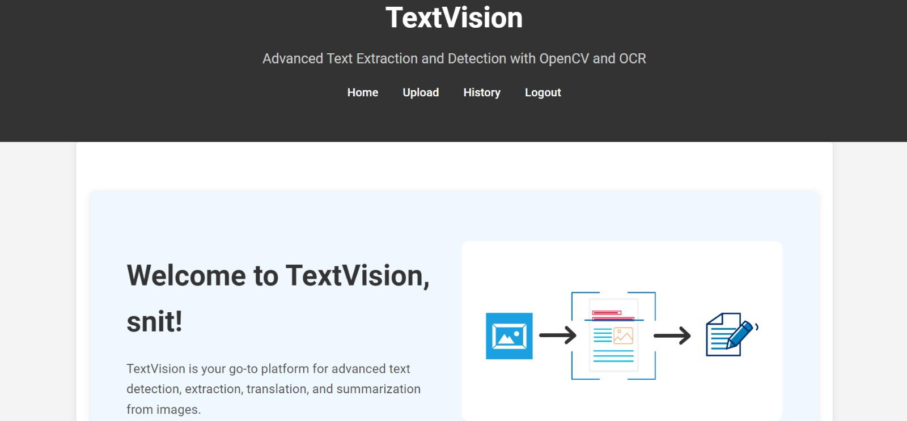
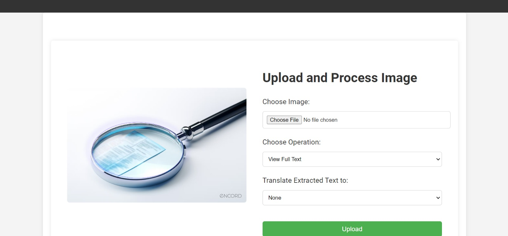
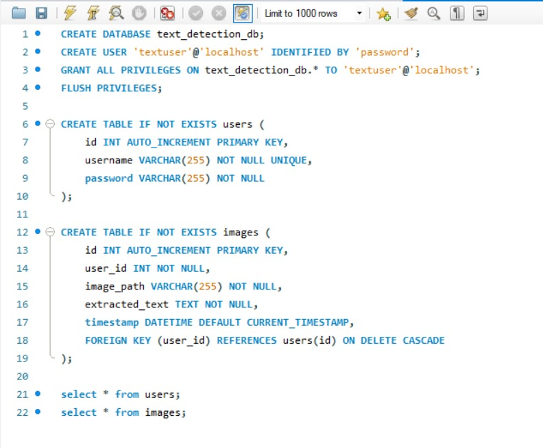
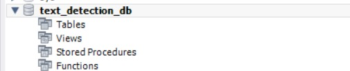
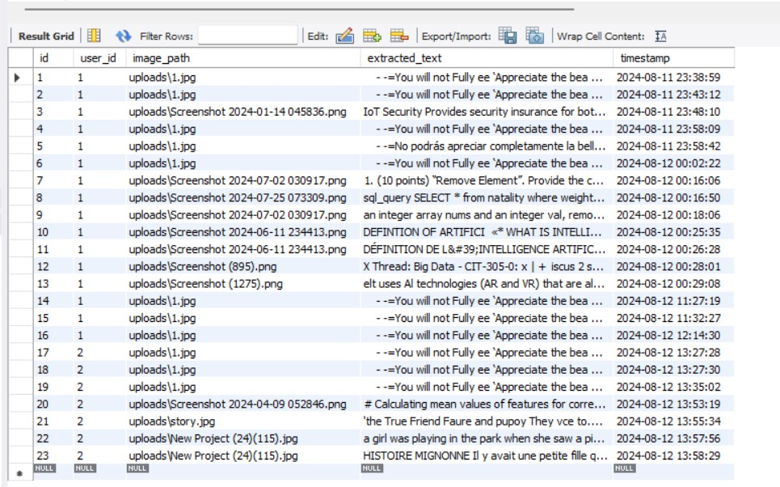
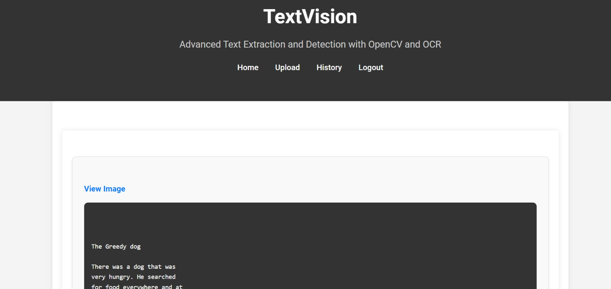

# Text Detection and Extraction System

## Overview

Text detection and extraction involve identifying and extracting text from images. This process is crucial in various applications, such as digitizing printed documents, automatic license plate recognition, and extracting text from images for further processing.

The goal of this project is to develop a robust system that efficiently detects and extracts text from images using OpenCV and Optical Character Recognition (OCR) technologies. This system aims to provide accurate text extraction capabilities for diverse applications, including document processing and real-time analysis.

## Target Users

- **Businesses and Organizations**: Automating document processing, data entry, and archival.
- **Educational Institutions**: Converting printed textbooks and research materials into digital formats.
- **Healthcare Providers**: Digitizing patient records and handwritten notes.
- **Developers and Data Scientists**: Integrating text extraction into various applications and research projects.

## System Features

### User Interaction
- **Image Upload**: Users can upload an image via the web interface.
- **Text Processing Options**: After uploading, users can choose to view, translate, or summarize the extracted text.


### Text Processing
- **OCR Processing**: Images are processed for OCR using Tesseract.
- **Text Display**: Extracted text is stored and displayed on the web interface.
- **Optional Features**: Users can choose to translate or summarize the extracted text.

### Database Interaction
- **Metadata Storage**: Image metadata and results are stored in MySQL.


- **History Retrieval**: Users can retrieve the history of processed images.


### Output
- **Text Display**: Processed text is displayed on the web interface.

- **User Options**: Users can view, translate, or summarize the text as required.

## Technology Stack

### Development Tools
- **VS Code**: Main IDE for development.
- **MySQL Workbench**: For database management.
- **Conda Environment**: Isolated Python environment to manage dependencies.

### Environment Setup
- **Conda Environment**: Created with necessary dependencies for the project.
- **VS Code Extensions**:
  - Python
  - Flask Snippets
  - Pylint
  - Jinja

### System Design
- **SQL**: For managing user data, image metadata, and text processing history.
- **HTML/CSS**: For creating a responsive and user-friendly web interface.
- **JavaScript**: For enhancing interactivity on the web pages.
- **Flask**: To handle routing, form submissions, and server-side processing.
- **Tesseract-OCR**: For extracting text from uploaded images.
- **Google Cloud Translate**: For translating extracted text into multiple languages.
- **Hugging Face Transformers**: For summarizing extracted text.

## Modules and Packages

### Imported Modules
- **Flask**: `Flask`, `render_template`, `request`, `session`, `flash`, `redirect`, `url_for`
- **Werkzeug**: `secure_filename`
- **OpenCV**: `cv2`
- **Pytesseract**: `pytesseract`
- **Google Cloud Translate**: `translate_v2 as translate`
- **Langdetect**: `lang_detect`
- **Transformers**: `pipeline`
- **MySQL Connector**: `mysql.connector`
- **OS/Datetime**: `os`, `datetime`

### Installed Packages
- **opencv-python**: OpenCV library for image processing.
- **pytesseract**: Python wrapper for Tesseract-OCR.
- **Flask**: Web framework.
- **google-cloud-translate**: Google Cloud API for translation.
- **langdetect**: Library for detecting text language.
- **transformers**: Hugging Face Transformers for text summarization.
- **mysql-connector-python**: Python MySQL connector.

## Steps to Run the Project

### 1. Clone the Repository
Start by cloning the project repository to your local machine:
```bash
git clone <repository_url>
cd <repository_folder>
```

### 2. Set Up the Conda Environment
Create and activate a Conda environment with the necessary dependencies:
```bash
conda create --name text_extraction_env python=3.8
conda activate text_extraction_env
```

### 3. Install Required Packages
Install the required Python packages using `pip`:
```bash
pip install opencv-python
pip install pytesseract
pip install Flask
pip install google-cloud-translate
pip install langdetect
pip install transformers
pip install mysql-connector-python
```

### 4. Set Up MySQL Database

1. **Install MySQL**: Ensure you have MySQL installed on your machine. If not, download and install it from the [official website](https://dev.mysql.com/downloads/).

2. **Create a Database**:
   Open MySQL Workbench or your preferred MySQL client and create a new database:
   ```sql
   CREATE DATABASE text_extraction_db;
   ```

3. **Configure Database Connection**:
   Update the database connection settings in the project’s configuration file (e.g., `config.py` or directly in the Flask app code):
   ```python
   DB_HOST = 'localhost'
   DB_USER = 'your_username'
   DB_PASSWORD = 'your_password'
   DB_NAME = 'text_extraction_db'
   ```

4. **Run Migrations or Set Up Tables**:
   If your project includes migration files, run them to set up the tables. Otherwise, manually create the necessary tables using MySQL scripts provided in the project.

### 5. Configure Google Cloud Translate API

1. **Create a Google Cloud Project**:
   Go to the [Google Cloud Console](https://console.cloud.google.com/) and create a new project.

2. **Enable Google Cloud Translate API**:
   Enable the Google Cloud Translate API for your project.

3. **Download Service Account Key**:
   Create a service account, download the JSON key file, and place it in the project directory.

4. **Set Up Environment Variable**:
   Set the environment variable for the Google Cloud credentials:
   ```bash
   export GOOGLE_APPLICATION_CREDENTIALS="path/to/your/service-account-file.json"
   ```

### 6. Run the Flask Application
Start the Flask development server:
```bash
python app.py
```

### 7. Access the Web Interface
Open your web browser and navigate to:
```bash
http://localhost:5000
```
You should see the web interface where you can upload images, extract text, and use additional features like translation and summarization.

### 8. (Optional) Deploy the Application
To deploy the application, follow deployment steps for your chosen platform, such as Heroku, AWS, or Google Cloud. Ensure to configure environment variables and update database settings according to the production environment.
